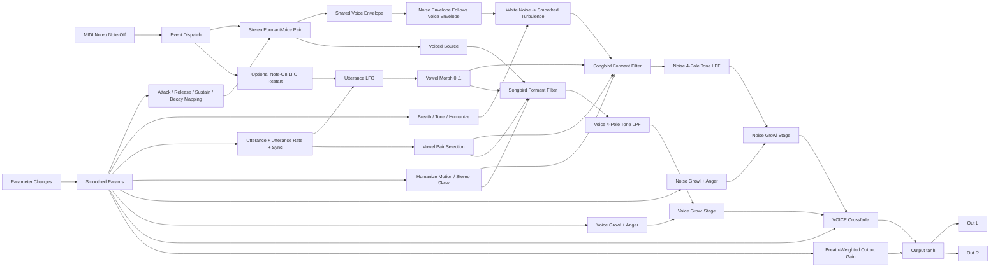

# Breathalyzer DSP Flow

## Control Mapping

- `SHAPE`: sets the core mouth/formant center used by the Daisy voiced generator.
- `UTTERANCE`: selects the neighboring vowel region used by the Songbird formant filters. Low values stay near `A-E`; high values move toward `O-U`.
- `BREATH` (`VOLUME` in the breath column): drives airy noise amount, turbulence strength, and some brightness lift.
- `VOICE` (`VOLUME` in the voice column): crossfades between the processed breath branch and the processed voiced branch.
- `ATTACK`: maps to the voiced ADSR attack time and therefore also shapes the breath path because the noise branch follows the same envelope.
- `RELEASE`: maps to the voiced ADSR release time.
- `HUMANIZE`: adds slow left/right motion, spectral skew, stereo spread, and cutoff divergence.
- `TONE`: drives the final four-pole lowpass cutoff on both voice and noise branches.
- `VOICE SPEED` (`UTTERANCE RATE` in the UI): sets the utterance LFO rate in Hz.
- `UTTERANCE SYNC`: when enabled, resets the utterance LFO at note-on; otherwise it free-runs.
- `VOICE GROWL` (`GROWL` in the voice column): distortion character for the voiced branch.
- `VOICE GROWL INTENSITY` (`ANGER` in the voice column): wet/dry amount for the voiced growl stage.
- `NOISE GROWL` (`GROWL` in the breath column): distortion character for the noise branch.
- `NOISE GROWL INTENSITY` (`ANGER` in the breath column): wet/dry amount for the noise growl stage.

## Implementation Notes

- Breathalyzer is MIDI-only. There is no audio input bus.
- The voiced generator is the vendored Daisy `FormantVoice` path under `vst3/src/dasiydsp`.
- The vowel filtering is a vendored WE-Core / Songbird subset under `vst3/src/WeCore`.
- Both the voiced branch and the breath-noise branch pass through the Songbird formant stage, so utterance motion reads as one shared mouth shape.
- The utterance filter does not just sweep `A` to `E` anymore. `UTTERANCE` moves the sweep across adjacent vowel pairs in the full `A/E/I/O/U` set.
- The utterance LFO is normally free-running. `UTTERANCE SYNC` optionally restarts it on note-on.
- The noise and voice growl processors are separate and use separate random streams, so their wobble and chew motion do not lock together.
- `VOICE` is intentionally curved, not linear, so lower settings remain mostly airy and upper settings bring in the voiced body more decisively.
- Final output is soft-clipped with `tanh` after the branch blend and output gain stage.
