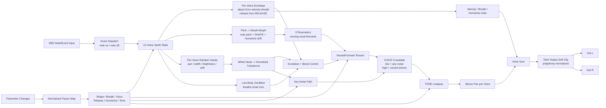

# Breathalyzer DSP Flow

## Control mapping

- `SHAPE`: shifts the note-to-mouth-color mapping, moving the formants between tighter, hissier colors and more open, rounded breath tones.
- `BREATH`: increases air amount, softens the attack shape, and raises the noisy breath contribution.
- `VOICE`: crossfades from mostly airy noise into more body and formant-colored voiced texture. The taper is strongly biased so low values stay close to breath noise.
- `RELEASE`: controls note-off decay. Internally it maps from normalized `0..1` to about `0.04 s .. 1.84 s` with a squared taper.
- `HUMANIZE`: adds small drift, pan spread, spectral variation, envelope variation, and per-note inconsistency.
- `TONE`: controls the final lowpass brightness after the airy/voiced blend.

## Notes

- Breathalyzer is a pure instrument path: no audio input bus is used, only MIDI events and parameter changes.
- Each note allocates or steals one of up to 12 voices, with note ID and pitch/channel matching used for note-off handling.
- Pitch does not set a conventional oscillator pitch. It mainly drives the mouth/formant morph, while the tonal body stays in a constrained low range.
- The noisy component starts from white noise, then derives a smoothed turbulence signal used both for airy hiss and for resonator excitation.
- The voiced path is produced by exciting three moving resonators whose center frequencies are interpolated from several vowel-like formant sets.
- The `VOICE` control does not linearly mix noise and tone. It uses a steep curve so the lower half remains mostly breathy and only the upper range adds obvious human-like body.
- Every voice gets a small random stereo pan and variation offsets, then all active voices are summed, normalized by active voice count, and soft-clipped with `tanh`.
- Silence flags are set from synth voice activity so the host can treat the instrument as silent when no voices remain active.
